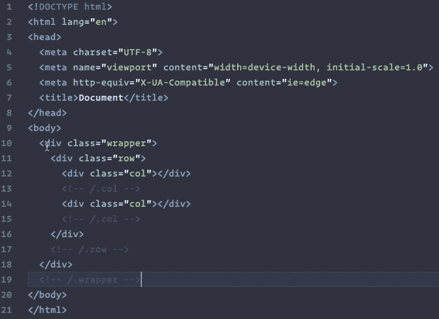

# HTML Nested Comments

**The problem**: if your HTML code contains a comment, and you want to add a new comment to temporarily disable a block or portion of code, the built in commenting functionality does not actually place the comment tags in expected locations. If an existing comment is included in the content being commented out, the first instance of a `-->` closing comment tag will end the entire comment.

**The solution**: The extension very simply finds all comments within the highlighted block of code and converts dashes to tildes, and then places the comment tags in the expected locations. It also then reverses the effect to uncomment the same code.

## Features

If you need to comment out a portion of your code that includes pre-existing comments, the native commention functionality will not comment properly or preserve your existing comments. This extension will maintain your original comments and allow you to quickly toggle comments on sections of code.

## Extension Settings

The following file formats are supported:

- asp
- cfm
- htm
- html
- md
- njk
- php
- svg
- vue
- xml

## Known Issues

None at this time 😃

## Release Notes

Full release notes are available in the CHANGELOG file.